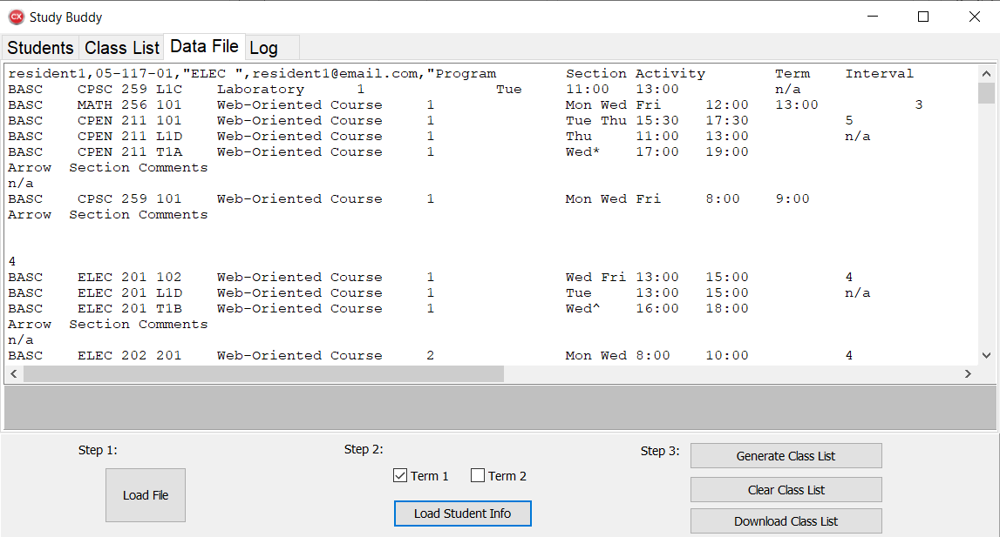
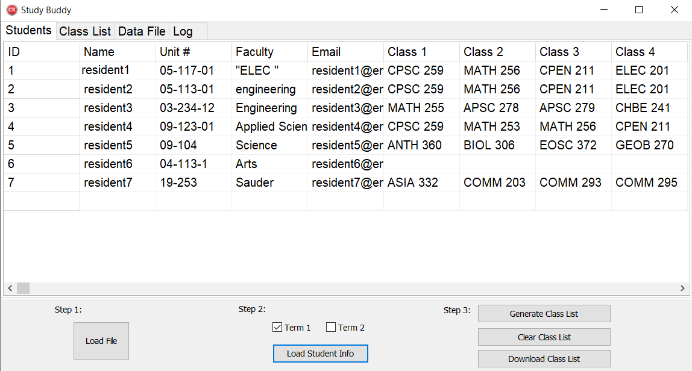
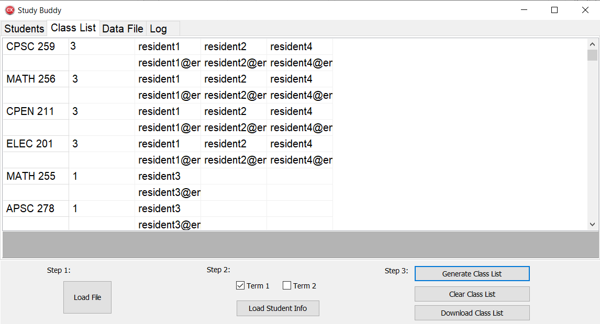

Automatic “Study Buddy Finder” App that extracts data from a csv file containing student’s course registration information and automatically groups students in the same course.
Intuitive UI enabled a team of 35 Resident Advisors with varying technology comfort levels to connect their residents to their study buddies with minimal effort and time. Proccess is also simplified for resident as they only need to copy and paste their course schedule from univserity website into an online form - no formatting or editing on their end required! 

## Instructions

**1. Load csv file: **

Program will parse through raw file and organize infomation of interest

**2. Select school term you are interested in: **

Program will compile list of residents and their registered courses

**3. Generate list of students in each class:**

User can decide to download the list as an excel file as well

